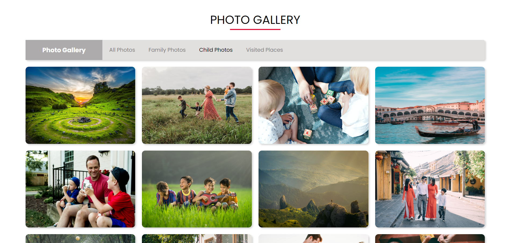

# Photo Gallery Project

## Table of Contents

- [Links](#links)
- [Description](#description)
- [Screenshot](#screenshot)
- [Demo](#demo)
- [Features](#features)
- [Technologies Used](#technologies-used)
- [Usage](#usage)
- [What I Learned](#what-i-learned)
- [Contributing](#contributing)

## Links

- **Solution URL:** [GitHub Repository](https://github.com/aruntutter/photo-gallary_with_html-css)
- **Live Demo:** [Live Demo URL](https://poetic-choux-7f881e.netlify.app/)

## Description

This project is a simple and elegant photo gallery created using HTML and CSS. It provides a user-friendly design with categorized photos, allowing users to navigate through different photo collections.

## Screenshot



## Demo

Check out the live demo of the project [here](https://poetic-choux-7f881e.netlify.app/).

## Features

- Categorized photos: All Photos, Family Photos, Child Photos, Visited Places.
- Animated title with a dynamic underline effect.

## Technologies Used

- HTML
- CSS
- FlexBox

## Usage

1. Clone the repository to your local machine:

   ```bash
   git clone https://github.com/your-username/photo-gallery.git
   ```

-Open the project in your preferred code editor.

-Open the index.html file in a web browser to view the photo gallery. Click on the category labels to filter photos based on the selected category.

# Example command to open in a browser

firefox index.html

## What I Learned

While working on this project, I gained insights into:

- Implementing animated effects using CSS.
- Structuring and organizing a simple web project.

## Contributing

Contributions are welcome! Feel free to open issues or submit pull requests to improve the project.
